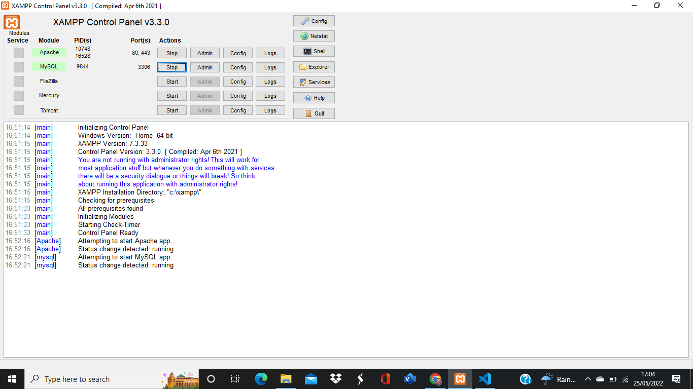
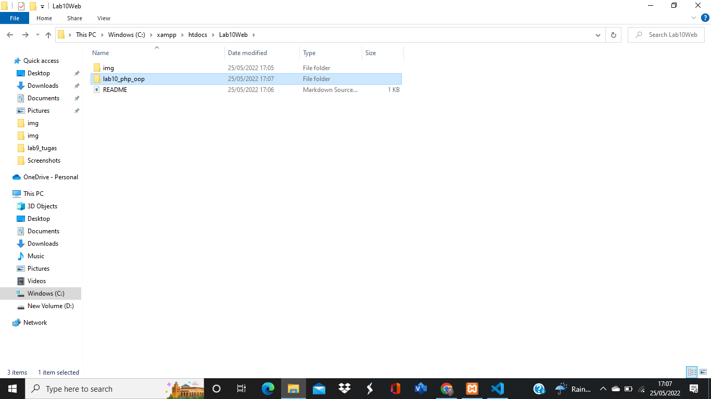
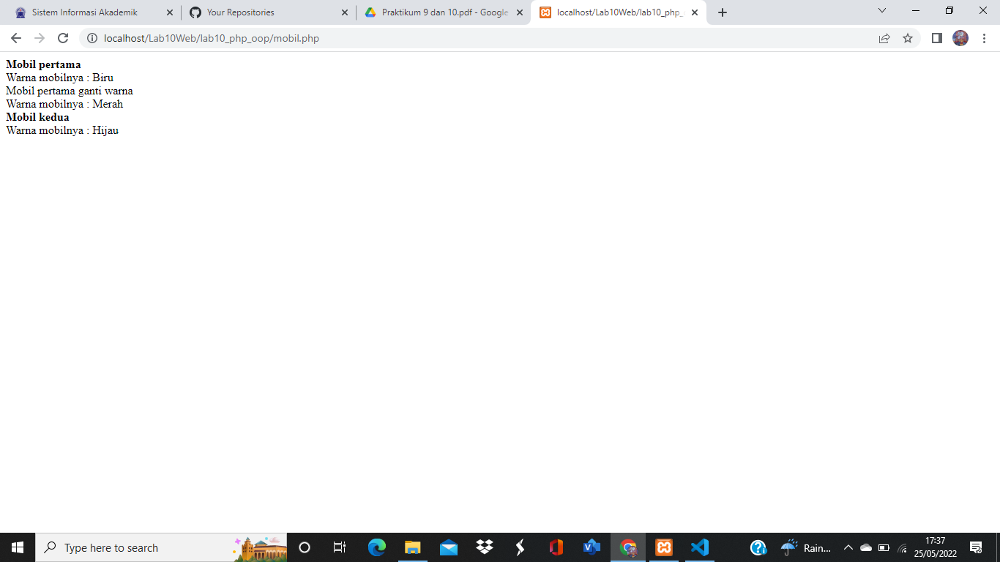

| HERLIYANSYAH      |   312010387       |
|-------------------|-------------------|
| TI.20.A.2         | PEMROGRAMAN WEB   |
| PERTEMUAN 11      | PRAKTIKUM 10      |

## PERTEMUAN 11

## LAB 10 WEB

## PRAKTIKUM 10

Dipertemuan kali ini kita akan mempelajari  **PHP OOP**

## LANGKAH - LANGKAH PRAKTIKUM

## 1). MENJALANKAN XAMPP SERVER


**PENJELASAN**

Menjalankan xampp server

## 2). BUAT FOLDER BARU DENGAN NAMA **lab10_php_oop**


**PENJELASAN**

Setelah itu jalankan dengan mengakses URL: http://localhost/Lab10Web/lab10_php_oop/

## 3). BUAT FILE BARU DENGAN NAMA **mobil.php**


**PENJELASAN**

Menggunakan **class** dan **pemanggilan class**

**code php**
```php
<?php
/**
* Program sederhana pendefinisian class dan pemanggilan class.
**/

class Mobil
{
    private $warna;
    private $merk;
    private $harga;

    public function __construct()
    {
        $this->warna = "Biru";
        $this->merk = "BMW";
        $this->harga = "10000000";
    }
    
    public function gantiWarna ($warnaBaru)
    {
        $this->warna = $warnaBaru;
    }

    public function tampilWarna ()
    {
        echo "Warna mobilnya : " . $this->warna; 
    }
}

// membuat objek mobil
$a = new Mobil();
$b = new Mobil();

// memanggil objek
echo "<b>Mobil pertama</b><br>";
$a->tampilWarna();
echo "<br>Mobil pertama ganti warna<br>";
$a->gantiWarna("Merah");
$a->tampilWarna();

// memanggil objek
echo "<br><b>Mobil kedua</b><br>";
$b->gantiWarna("Hijau");
$b->tampilWarna();

?>
```

## 4). BUAT FILE BARU DENGAN NAMA **form.php**

